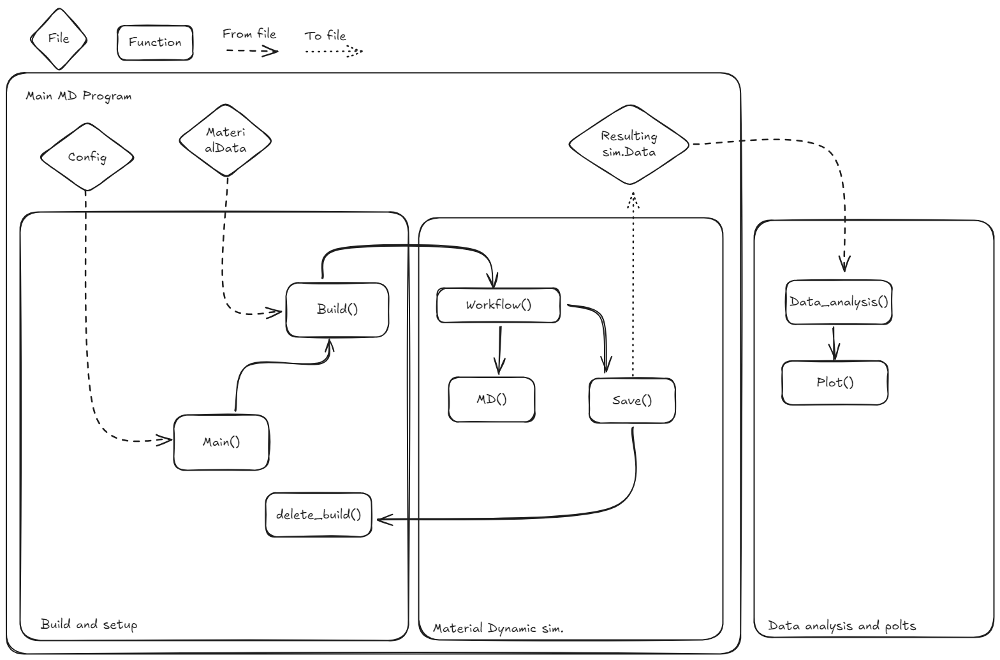

# Project Plan

## Introduction 
This program means to preform a material dynamic simulation on an array of materials with a selected number of degrees of freedom. The data extracted from the simulation will then be analyzed and plotted.
The main simulation will consist of forces applied to a bulk material to simulate a stress on the material casing it to fracture.

Lägga till mer här. Ta från projektdiriktivet.
## Program schematic

### Main()

### Build()

### Workflow()

### Md()

### Save()

### Delete_build()

### Data analysis and plots

## Roadmap
The project will be divided in to tree (possibly overlapping) phases. The "Build and setup phase", the "Material simulation phase" and the "Data analysis and plotting phase". These are also depicted in the program schematic.

### Milestones
- Simulating a tear in a bulk material
- Finishing the finale report

### Backlog
Below is a list of the backlog for the project, divided into epics, and some of their stories. Each story will be divided into tasks which are left as undetermined at this stage of the project. The stories are only outlined, with reservation to changes further ahead in the project.

#### Build and setup
This epic contains everything that is needed to initialize a simulation. Here, all data preparation, creation and deletion of a simulation cell, setting up the main workflow of the whole product, etc. Stories include:
- Create a main-function that runs the entire program,
- create a function that builds a supercell,
- create a function that deletes old supercells that have already been simulated.

#### Molecular dynamics simulation
The molecular dynamics (MD) part of the project is the part that runs the actual simulations. This is what will be queued up at the supercomputers. Stories include:
- Create a workflow-function that decides how the MD-simulation will be performed,
- create an MD funcion,
- create a function that saves relevant data from an MD run.

#### Data analysis
This is the last part of the program, as well as the development. In this part of the program all data that has been saved from the MD-runs of different materials will be analyzed, both individually and against each other. Stories include:
- Create a data analysis-function that compiles relevant data from MD-simulations,
- create a plotting function that visualizes the compiled data in a relevant way.

