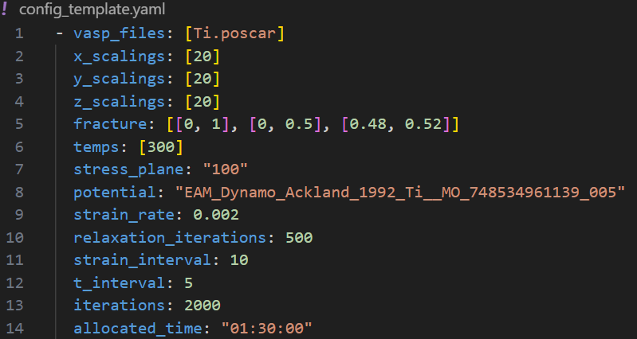

# User Manual for FractureMD
This user manual descibes how to install FracturMD, it states which dependencies that are needed, describes the config-file, 
tells you how to 
run the program and how to generate the Sphinx Documentation. 

## Installation
The following section tells you which dependencies you need to be able to run the program, and how to download the actual code. 

### Download program
To download the program, 
go to [this github page ](https://github.com/Lophtix8/CDIO/tree/main) and clone the repository. 


### Dependencies
The following dependencies are needed:
* yaml
* ase
* numpy
* matplotlib

It is also necessary to navigate to the program folder "CDIO" and write the folloing in the terminal:

```
pip install .
```
 


## Config-file
A configuration file is necessary to run the program. All important information about a simulation is stated in this file, see an example config-file below. 




The following is needed in the config-file:
*  **vasp_files**: One or several poscar-files, containing the unitcells of the materials to simulate. These files need to exist in the material_database folder. 
* **x_scalings**: A list of numbers saying how many times the unit cell is going to be repeated in the x-direction, in the supercell.
* **y_scalings**:  A list of numbers saying how many times the unit cell is going to be repeated in the y-direction, in the supercell.
* **z_scalings**:  A list of numbers saying how many times the unit cell is going to be repeated in the zdirection, in the supercell.
* **fracture**: Specify an x-, y- and z-interval in fractional coordinates. Atoms within these intervals will be removed from the supercell.
* **temps**: A list of temperatures, in Kelvin, that are used for the simulations. All materials specified in vasp\_files as well as all different scaling, will be run with all temperatures. 
* **stress_plane**: Specify which plane the strain is applied to. Choose a plane by writing the following: x-plain: "100", y-plane: "010", z-plane: "001"
* **potential**: Potential-id from OpenKim, for the specific material. 
* **strain_rate**: How much the strain increases, in percent. The strain increases after strain\_interval- iterations.
* **relaxation_iterations**: How many iterations the supercell relaxes before the first strain is applied. 
* **strain_interval**: Number of iterations before the strain increases. 
* **t_interval**: The time step used in the calculator for the equations of motion. 
* **iterations**: Number of iterations in a simulation. 
* **allocated_time**: Time to allocate on the supercomputer for the simulations, given as "hours:minutes:seconds" 


## How to run the program

Make sure you have done all of the steps above before you run the program. 

To run the program, the main.py file and a config file on the format specified above, are needed. Then type in the terminal:

```
python3 main.py <config_file.yaml> <type of job>
```
Where \<type of job\> has the options: p, to prepare the supercells and the .q-scrips and the second option is pq, to prepare and queue the jobs on the uspercomputer. 


## Sphinx Documentation
To generate the Sphinx Documentation, stand in the sours file "docs" and run the command:

```
make html
```

Then run the documentation website by running the "_build/html/index.html" file with a browser, for example like this:
```
firefox _build/html/index.html
```